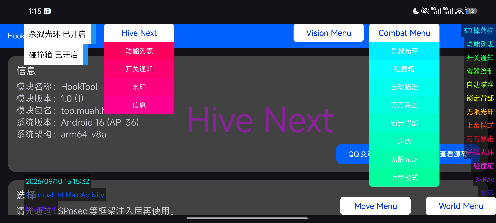

# HiveNext-UI 2
通过XPosed实现的游戏辅助UI模板。

(不包含任何实际作弊功能！)

__仅供学习使用，严禁用于任何非法用途！__
# 更新内容
1. 重构渐变。
2. 重构通知以及水印功能。
3. 功能菜单与快捷键添加圆角。
# 交流
QQ交流群：[975967340](https://qm.qq.com/q/KnEh9Rm1iu)。

QQ项目专属群：[764494393](https://qm.qq.com/q/OMFabZNjgG)。
# 特征
1. 无Java8语法；
2. 支持LSPatch等免Root框架；
3. 漂亮的渐变GUI。
# 赞助
微信：[op.muah.top](https://op.muah.top)
# 开源协议
MIT 协议
